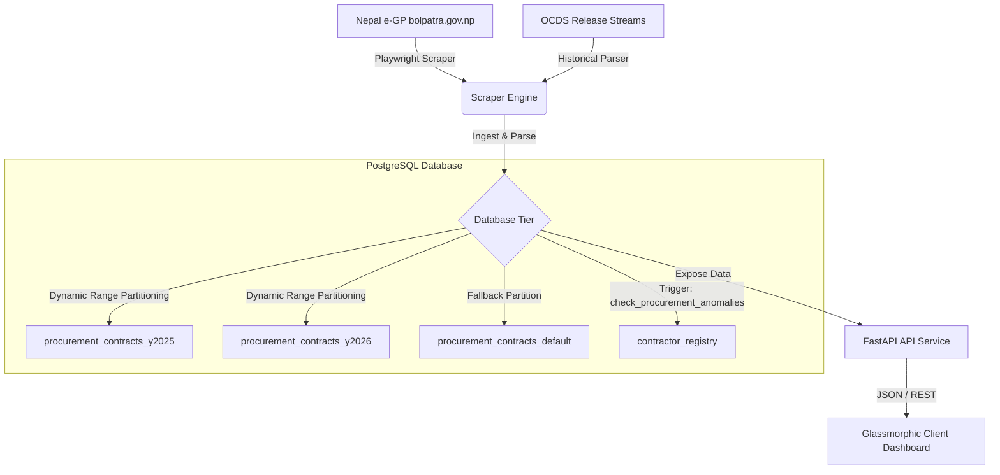

# 🔵 Civil Portal: Public Procurement Transparency Pipeline (Phase 1)

An open-source, automated civic-tech intelligence pipeline that ingests, partitions, and audits public procurement contract data directly from the official Nepal e-GP platform (bolpatra.gov.np) and historical OCDS releases.

The platform processes procurement records, routes them into partitioned tables based on fiscal years, runs database-tier triggers to identify high-risk bid patterns (single-bidder anomalies and shell company awards), and serves them via a FastAPI backend to a high-contrast citizen dashboard.

---

## 🚀 Features

1. **Live e-GP Scraper**:
   - Playwright (headless Chromium) engine targeting finalized contracts directly from government portals without mock fallbacks.
   - Robust parsing of PDF and HTML tender notices, capturing contractor details, dates, bid amounts, and bidder counts.

2. **PostgreSQL Time-Series Partitioning**:
   - Declarative range partitioning split by fiscal years (`y2025`, `y2026`) with a default fallback partition (`default`).
   - Dynamic routing of contract records based on the `award_date` column.
   - Dedicated indexes on contractor and flagged fields for fast query performance.

3. **Forensic Audit Engine**:
   - Database-level PL/pgSQL triggers (`check_procurement_anomalies`) running instantly on insert/update.
   - Identifies and flags high-risk single-bidder non-competitive assignments.
   - Identifies and flags shell company registrations (companies registered less than 30 days prior to receiving an award).
   - Dynamic registration/back-propagation of contractor registry metadata.

4. **FastAPI Backend Service**:
   - High-performance API hosting paginated endpoints with search and risk-filtering parameters (`red_flags_only`).
   - Leaderboard statistics endpoint summarizing total contract awards, amounts allocated, and cumulative anomalies per contractor.

5. **Glassmorphic Citizen Dashboard**:
   - Premium dark-themed glassmorphic user interface displaying real-time contract audits.
   - Live filters, interactive search, and localized Nepalese compact currency formats (करोड / lakh).
   - $O(1)$ client-side filtering engine for smooth, instant data exploring.

---

## 🏗️ Architecture



---

## 🛠️ Tech Stack

- **Backend & Scrapers**: Python 3.11+, Playwright, BeautifulSoup4, FastAPI, Uvicorn
- **Database**: PostgreSQL 15+ with PostGIS extensions
- **Frontend**: HTML5, Vanilla CSS3 (custom glassmorphic theme), Vanilla ES6 JavaScript
- **Infrastructure**: Docker, Docker Compose

---

## 📂 Repository Structure

```
civil-portal/
├── backend-api/            # FastAPI API engine service
│   ├── Dockerfile
│   ├── main.py             # App entrypoint and REST endpoints
│   └── requirements.txt
├── client-dashboard/       # Static frontend user dashboard
│   ├── Dockerfile          # Nginx server configuration
│   ├── app.js              # Frontend logic and data fetching
│   ├── index.html          # High-contrast dashboard page
│   └── styles.css          # Glassmorphic layout styles
├── core-scrapers/          # Data collection agents & verification scripts
│   ├── Dockerfile
│   ├── scraper_bolpatra.py # Playwright bolpatra scraper
│   ├── scraper_procure.py  # Central schema creation & database sync
│   ├── scraper_historical.py# Historical OCDS parser
│   ├── verify_db_and_api.py# Validation check suite
│   ├── requirements.txt
│   └── *.json/*.jsonl      # Baseline seed datasets
├── db-data/                # Persistent database mount (Docker)
├── docker-compose.yml      # Orchestration file
└── LICENSE                 # Public MIT License
```

---

## ⚙️ Quick Start (Local Deployment)

### Prerequisites
- [Docker](https://www.docker.com/) and [Docker Compose](https://docs.docker.com/compose/) installed on your machine.

### Build and Run

1. **Clone the repository**:
   ```bash
   git clone https://github.com/kaji-maker/civil-portal.git
   cd civil-portal
   ```

2. **Spin up the multi-container stack**:
   ```bash
   docker-compose up -d --build
   ```
   This command starts the database, the API service, and the frontend dashboard on your system.

3. **Verify the services**:
   - **Frontend UI**: Open [http://localhost:3000](http://localhost:3000)
   - **FastAPI Documentation**: Open [http://localhost:8000/docs](http://localhost:8000/docs)
   - **PostgreSQL**: Available on port `5432`

---

## 🔍 Running Data Ingestion & Scrapers

To populate the database with live e-GP records or historical OCDS data, execute the scrapers inside the container:

### Run the Ingestion Suite
You can activate the `procurement-scraper` container (which uses the `scrapers` profile) using Docker Compose:

```bash
# Initialize schemas and seed database with historical/real OCDS releases
docker-compose run --rm procurement-scraper python scraper_procure.py

# Run the live e-GP Playwright web scraper
docker-compose run --rm procurement-scraper python scraper_bolpatra.py
```

### Validate System Integrity
Run the built-in validation script to query record distributions across partitions, verify index presence, and check the red-flag trigger invariants:

```bash
docker-compose run --rm procurement-scraper python verify_db_and_api.py
```

---

## 🛡️ Database Schema & Forensic Triggers

### 1. Dynamic Partitioning Range
The `procurement_contracts` table is partitioned on the `award_date` column using PostgreSQL declarative range partitioning:
- **`procurement_contracts_y2025`**: Values from `2025-01-01` to `2026-01-01`.
- **`procurement_contracts_y2026`**: Values from `2026-01-01` to `2027-01-01`.
- **`procurement_contracts_default`**: Fallback for any dates falling outside these ranges.

### 2. Forensic Red Flag Trigger
A database trigger runs `BEFORE INSERT OR UPDATE` to automatically flag high-risk contracts:
- **Single-Bidder Anomalies**: Checked if `bidders_count = 1` for an active contract.
- **Shell Company Anomalies**: Checked if `award_date - registration_date < 30 days`.

---

## 📄 License

This project is licensed under the **MIT License** - see the [LICENSE](LICENSE) file for details.
